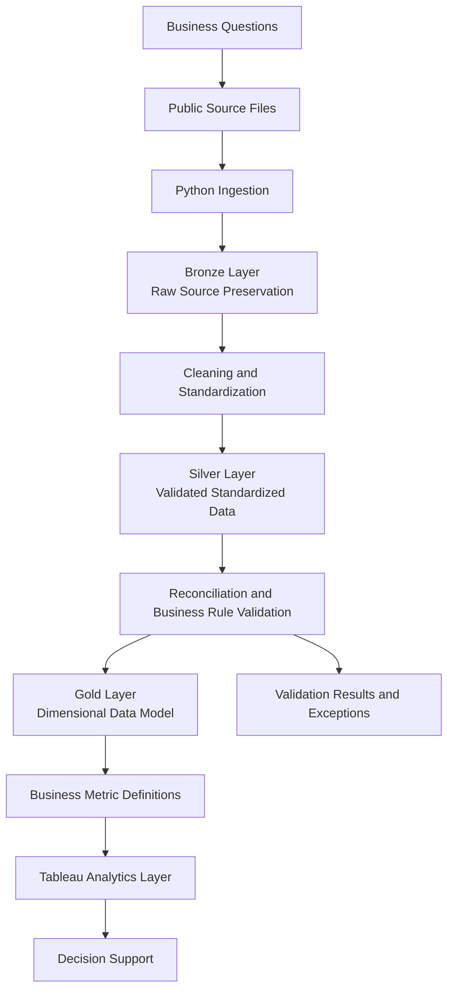
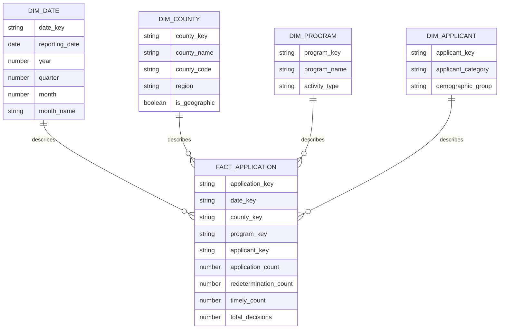
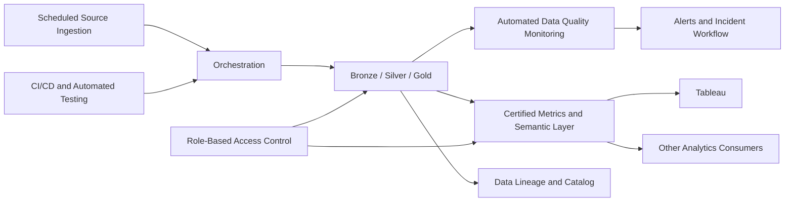

# SNAP Analytics Platform V2 — Architecture

## 1. Purpose

This document describes how the SNAP Analytics Platform V2 is technically structured and engineered.

It covers:

- system components and data flow;
- repository organization;
- data ingestion, transformation, validation, and loading;
- Snowflake warehouse layers and dimensional modeling;
- technology responsibilities;
- major architecture decisions and trade-offs;
- the boundary between the current prototype and future production-oriented capabilities.

Product goals, target users, business problems, and success metrics are documented separately in `Product_Design.md`.

---

## 2. Overall Architecture

The platform uses a batch-oriented analytics architecture that transforms public program source files into validated, modeled, and reusable analytical datasets.



### 2.1 Architecture Components

| Component | Responsibility |
|---|---|
| Source Files | Provide public SNAP application, redetermination, county, and timeliness data. |
| Ingestion Layer | Read source workbooks, identify required worksheets and tables, preserve source-level values, and prepare data for loading. |
| Bronze Layer | Store raw ingested records with minimal modification for traceability and reprocessing. |
| Transformation Layer | Standardize column names, data types, geographic values, dates, percentages, and record formats. |
| Silver Layer | Store cleaned and structurally consistent records. |
| Validation Layer | Apply schema checks, reconciliation rules, business-rule validation, duplicate checks, and exception reporting. |
| Gold Layer | Organize trusted analytical data into fact and dimension tables. |
| Business Metrics Layer | Centralize reusable KPI calculation logic used by downstream analytics. |
| Analytics Layer | Present program demand, operational performance, geographic distribution, and timeliness metrics through Tableau. |

### 2.2 Processing Model

The current platform uses scheduled or manually triggered batch processing rather than streaming.

Each pipeline run follows this sequence:

1. Read the configured source file.
2. Extract the required worksheet or table.
3. Preserve source data in the Bronze layer.
4. Standardize and clean records.
5. run structural and business-rule validation;
6. write accepted records to the Silver layer;
7. generate validation exceptions for rejected or suspicious records;
8. transform validated data into Gold fact and dimension tables;
9. calculate reusable business metrics;
10. refresh or query the Tableau analytics layer.

The pipeline should fail clearly when a required source, worksheet, column, or critical validation rule is missing. Noncritical data-quality issues should be recorded as exceptions rather than silently removed.

---

## 3. Repository Structure

The repository should separate pipeline logic, warehouse logic, validation rules, metrics, tests, documentation, and configuration.

```text
snap-analytics-platform/
├── README.md
├── Product_Design.md
├── Architecture.md
├── pyproject.toml
├── .gitignore
│
├── config/
│   ├── pipeline_config.yaml
│   └── validation_rules.yaml
│
├── data/
│   ├── raw/
│   ├── sample/
│   └── output/
│
├── src/
│   └── snap_analytics/
│       ├── ingestion/
│       ├── transformation/
│       ├── validation/
│       ├── loading/
│       ├── metrics/
│       └── common/
│
├── sql/
│   ├── bronze/
│   ├── silver/
│   ├── gold/
│   └── metrics/
│
├── tests/
│   ├── unit/
│   ├── integration/
│   └── fixtures/
│
├── notebooks/
│   └── exploration/
│
└── dashboard/
    └── tableau/
```

### 3.1 Directory Responsibilities

| Directory | Responsibility |
|---|---|
| `config/` | Stores configurable source mappings, worksheet names, validation thresholds, and environment-specific settings. |
| `data/raw/` | Local raw data used for development. Sensitive or large source files should not be committed. |
| `data/sample/` | Small anonymized or public sample files that allow others to understand and test the project. |
| `data/output/` | Local pipeline outputs, validation reports, and generated artifacts. |
| `src/snap_analytics/ingestion/` | Source reading, worksheet extraction, and ingestion metadata. |
| `src/snap_analytics/transformation/` | Cleaning, type conversion, standardization, and record-shaping logic. |
| `src/snap_analytics/validation/` | Schema validation, reconciliation, business-rule checks, and exception generation. |
| `src/snap_analytics/loading/` | Snowflake connection and loading logic. |
| `src/snap_analytics/metrics/` | Reusable Python-side metric definitions when calculation does not belong exclusively in SQL. |
| `src/snap_analytics/common/` | Shared logging, configuration, constants, and utility functions. |
| `sql/` | Snowflake DDL, transformations, dimensional models, and metric queries organized by warehouse layer. |
| `tests/` | Unit and integration tests for pipeline behavior, validation rules, and model outputs. |
| `notebooks/` | Temporary exploration only; production pipeline logic should be moved into reusable modules. |
| `dashboard/` | Tableau workbook documentation, screenshots, extracts, and dashboard-related assets. |

### 3.2 Repository Rules

- Reusable logic belongs in `src/`, not in notebooks.
- SQL should be organized by warehouse layer and committed to version control.
- File paths, worksheet names, and thresholds should be configurable rather than hard-coded.
- Source data should not be modified in place.
- Validation failures must be observable through logs or exception outputs.
- Generated files, credentials, local environments, and large raw datasets must be excluded through `.gitignore`.
- Every implemented module should include tests before it is considered complete.

---

## 4. Data Pipeline

### 4.1 Ingestion

The ingestion layer reads public source files and extracts the required tables.

Its responsibilities include:

- validating that the file exists and is readable;
- confirming required worksheet names;
- detecting expected columns;
- separating multiple logical tables contained in one worksheet;
- recording source filename, worksheet, load timestamp, and pipeline run identifier;
- loading records without applying business transformations.

The ingestion layer should preserve enough source metadata to trace a downstream record back to its origin.

### 4.2 Transformation

The transformation layer converts raw records into a consistent analytical format.

Typical transformations include:

- standardizing column names;
- removing title, note, footer, and subtotal rows;
- separating statewide summary records from county-level records;
- excluding or classifying non-geographic records;
- converting percentage values such as `0.64` and `64%` into one standard representation;
- parsing date and numeric fields;
- standardizing county names and identifiers;
- reshaping wide source tables into analysis-ready records;
- assigning consistent null handling.

Transformation logic should be deterministic: the same input and configuration should produce the same output.

### 4.3 Validation

Validation is a separate pipeline responsibility rather than an informal check inside dashboard development.

Validation categories include:

#### Structural Validation

- required file and worksheet exist;
- expected columns are present;
- data types are convertible;
- required identifiers are not null;
- duplicate business keys are detected.

#### Reconciliation Validation

- county totals reconcile with published statewide totals when the source supports reconciliation;
- application and redetermination totals are not accidentally mixed;
- excluded summary or non-geographic records are documented;
- record counts are compared between pipeline stages.

#### Business-Rule Validation

- timeliness percentages remain within valid bounds;
- application counts are nonnegative;
- reporting periods are valid;
- county mappings are recognized;
- KPI denominators are not zero;
- decision-date logic is consistent with the defined timeliness rule.

#### Trend and Anomaly Checks

- unexpected month-over-month changes are flagged for review;
- missing reporting periods are detected;
- material changes in source structure are surfaced.

Validation outputs should contain:

- pipeline run identifier;
- rule name;
- severity;
- affected record or aggregate;
- observed value;
- expected condition;
- validation status;
- review notes when applicable.

### 4.4 Loading

The loading layer writes pipeline outputs to Snowflake.

The current design uses layer-specific loading:

- Bronze receives raw ingested records;
- Silver receives cleaned and validated records;
- Gold receives dimensional models and analytical aggregates.

Loads should be idempotent where practical. Re-running the same source period should not create uncontrolled duplicate records.

A batch should only be promoted to downstream layers after critical validation rules pass. Warning-level issues may be loaded with an associated exception record, depending on the rule.

### 4.5 Pipeline Observability

The prototype should record basic execution information:

- run identifier;
- source file;
- start and end timestamps;
- rows read;
- rows accepted;
- rows rejected or flagged;
- load status;
- error message;
- target table.

Full production monitoring is outside the current implementation, but the pipeline structure should make future orchestration and monitoring possible.

---

## 5. Data Warehouse Design

### 5.1 Bronze Layer

The Bronze layer preserves ingested source data with minimal transformation.

Primary purposes:

- source traceability;
- replay and reprocessing;
- investigation of downstream discrepancies;
- preservation of original source values.

Bronze tables may include ingestion metadata such as:

- `source_file_name`;
- `source_sheet_name`;
- `source_row_number`;
- `load_timestamp`;
- `pipeline_run_id`.

### 5.2 Silver Layer

The Silver layer stores standardized and validated records.

Primary purposes:

- consistent data types;
- normalized geographic and reporting-period values;
- removal or classification of summary and non-data rows;
- consistent null and percentage handling;
- reusable cleaned datasets independent of dashboard layout.

Silver represents clean domain data, but it is not yet optimized for business consumption.

### 5.3 Gold Layer

The Gold layer stores analysis-ready dimensional models and selected aggregates.

The proposed model is a star schema centered on program activity and performance.



The exact grain must be finalized before implementation. A likely aggregate grain is:

> One row per reporting period, county, program activity type, and available applicant category.

The project must not imply person-level records if the public source only contains aggregated statistics.

### 5.4 Fact and Dimension Responsibilities

| Model | Responsibility |
|---|---|
| `fact_application` | Stores measurable program activity and timeliness values at the defined analytical grain. |
| `dim_date` | Provides reusable calendar attributes. |
| `dim_county` | Standardizes county and geographic classifications. |
| `dim_program` | Separates application, redetermination, and other program activity types. |
| `dim_applicant` | Represents available applicant categories only when supported by the source data. |

### 5.5 Business Metrics Layer

The Business Metrics Layer centralizes KPI definitions above the Gold model.

It should define metrics such as:

- Application Count;
- Redetermination Count;
- Federal Timeliness Rate;
- Month-over-Month Change;
- County Share of Total Applications.

A metric definition should eventually include:

- metric name;
- business definition;
- formula;
- source model;
- grain;
- filters and exclusions;
- validation rule;
- owner and certification status.

In the current prototype, metric logic may be implemented through version-controlled Snowflake SQL views or metric queries. A dedicated semantic-layer product is a future enhancement, not a current implementation claim.

---

## 6. Technology Stack

| Technology | Current Responsibility |
|---|---|
| Python | File ingestion, table extraction, transformation, validation, exception generation, and load orchestration. |
| Pandas | Structured manipulation of public Excel and tabular source data. |
| Snowflake | Storage for Bronze, Silver, and Gold layers; SQL transformations; analytical querying. |
| SQL | Warehouse DDL, layer transformations, dimensional modeling, reconciliation, and KPI logic. |
| Tableau | Dashboard and exploratory analytics consumption. |
| Pytest | Unit and integration testing of Python pipeline behavior. |
| Git and GitHub | Version control, repository history, documentation, and portfolio publishing. |
| VS Code | Primary local development environment. |
| GitHub Copilot | AI-assisted implementation, explanation, test generation, refactoring, and code review support under human supervision. |
| YAML | Configuration for source mappings, validation rules, and pipeline settings. |

Technology selection does not imply that every listed capability is already fully implemented. Current status should be documented in the README and repository commits.

---

## 7. Design Trade-offs

### 7.1 Why Snowflake?

Snowflake provides a clear separation between storage, transformation, and analytics while supporting SQL-based warehouse modeling. It is also directly relevant to modern analytics engineering workflows.

Trade-offs:

- It introduces platform setup and cost considerations compared with a fully local database.
- The project remains batch-oriented and does not require Snowflake-specific scale.
- Some transformations could be completed locally, but using Snowflake demonstrates warehouse-centered design and reusable analytical models.

Decision:

Use Snowflake as the analytical warehouse while keeping the pipeline small enough to run with limited resources.

### 7.2 Why Bronze, Silver, and Gold?

Layering separates raw preservation, cleaning, and business-ready modeling.

Benefits:

- clearer debugging;
- traceability from dashboard to source;
- reusable cleaned datasets;
- controlled promotion after validation;
- easier explanation of responsibilities.

Trade-offs:

- additional tables and SQL;
- more orchestration steps;
- unnecessary complexity if every layer simply copies the previous layer.

Decision:

Use the layers only when each has a distinct responsibility. Do not create tables solely to imitate an enterprise medallion architecture.

### 7.3 Why a Star Schema?

A star schema provides explicit analytical grain, reusable dimensions, and predictable relationships for Tableau and metric calculations.

Benefits:

- easier KPI consistency;
- simplified filtering by date, county, program, and applicant category;
- better reuse than dashboard-specific flat files;
- clear fact-versus-dimension responsibilities.

Trade-offs:

- more modeling work than a single wide table;
- aggregate public data may not require many dimensions;
- dimensions must not imply detail absent from the source.

Decision:

Use a small star schema whose grain matches the public aggregate data. Avoid unnecessary dimensions.

### 7.4 Why a Separate Validation Layer?

Data-quality problems in the source can materially change reported metrics. Validation therefore needs explicit rules, outputs, and failure behavior.

Benefits:

- prevents silent corruption;
- supports reconciliation;
- creates observable exceptions;
- separates trust controls from formatting logic.

Trade-offs:

- requires additional code and test cases;
- some rules depend on source-specific assumptions;
- excessive rules can create maintenance burden.

Decision:

Implement a focused validation layer covering structural checks, reconciliation, critical business rules, and known source issues.

### 7.5 Why Python and SQL?

Python is well suited for irregular Excel ingestion, worksheet handling, source parsing, validation reports, and orchestration. SQL is better suited for warehouse transformations, relational modeling, and reusable metric queries.

Trade-offs:

- logic can become fragmented across two languages;
- unclear ownership may create duplicate transformations;
- developers must understand where each rule belongs.

Decision:

Use Python for source-facing and procedural logic. Use SQL for warehouse-facing relational transformations, dimensional models, and analytical metrics. Avoid implementing the same business rule in both places without a documented reason.

### 7.6 Why Tableau?

Tableau provides a clear consumption layer for interactive exploration and portfolio demonstration.

Trade-offs:

- workbook logic can duplicate warehouse logic;
- proprietary workbook files are less transparent in version control;
- dashboard extracts can become separate sources of truth.

Decision:

Keep metric and transformation logic upstream whenever possible. Tableau should primarily visualize governed Gold models and metric outputs.

### 7.7 Why Batch Processing?

The source data is periodically published and does not require real-time processing.

Benefits:

- matches source refresh frequency;
- simpler failure recovery;
- lower implementation complexity;
- easier local development and demonstration.

Trade-offs:

- delayed availability;
- manual execution until orchestration is added;
- no event-driven updates.

Decision:

Use batch processing for the current platform. Real-time streaming is not justified by the source or analytical use case.

### 7.8 Why Excel or Public Files as the Source?

The project is based on publicly available program data, often distributed as spreadsheets or static reports.

Benefits:

- accessible and reproducible;
- appropriate for a public portfolio;
- exposes realistic ingestion and data-quality challenges.

Trade-offs:

- inconsistent layouts;
- manual publishing schedules;
- limited metadata and lineage;
- aggregate data limits analytical depth.

Decision:

Treat file ingestion as a realistic source constraint, not as the ideal production interface. Preserve source metadata and isolate source-specific parsing logic so APIs or managed feeds could replace files later.

### 7.9 Why Not Add a Dedicated Semantic-Layer Tool Now?

The project first needs stable Gold models and clearly defined metrics.

Trade-offs:

- adding a semantic-layer product too early increases setup and abstraction;
- metric definitions may change while the data model is still evolving;
- tool adoption could become portfolio decoration rather than solve a real problem.

Decision:

Implement version-controlled metric definitions first. Evaluate a dedicated semantic layer only after multiple consumers or repeated metric reuse justify it.

---

## 8. Future Architecture

The following capabilities represent a production-oriented roadmap and are not current implementation claims.



Potential future capabilities include:

### 8.1 Orchestration and Scheduling

- scheduled pipeline execution;
- dependency management;
- retry and failure handling;
- environment-specific deployment.

Possible tools may include GitHub Actions, Snowflake Tasks, or a workflow orchestrator. No tool should be selected until orchestration requirements are defined.

### 8.2 Data Quality Monitoring

- persistent validation history;
- trend-based anomaly detection;
- severity-based alerting;
- dashboard for pipeline and data-quality status;
- ownership and resolution workflow.

### 8.3 Metric Catalog and Certification

- searchable metric definitions;
- business owner;
- technical owner;
- formula and grain;
- source lineage;
- validation status;
- draft, reviewed, and certified states.

### 8.4 Semantic Layer

A future semantic layer could expose certified metrics consistently to Tableau and other consumers. It should be introduced only when the project has multiple downstream consumers or enough metric reuse to justify the additional abstraction.

### 8.5 Data Lineage and Catalog

- source-to-column lineage;
- transformation ownership;
- model dependencies;
- data dictionary;
- impact analysis.

### 8.6 Access Control

- environment separation;
- role-based Snowflake permissions;
- protected credentials;
- least-privilege access;
- separation of development and published analytics.

### 8.7 CI/CD

- formatting and linting;
- unit tests;
- SQL validation;
- pipeline integration tests;
- controlled deployment;
- pull-request review checks.

### 8.8 Multi-Year Data

Future versions may ingest additional reporting years and support:

- year-over-year analysis;
- longer-term trends;
- source-schema version handling;
- historical restatement control.

---

## 9. Current Prototype Boundary

The current project should be described as a production-inspired prototype.

### Current or Near-Term Implementation

- public file ingestion;
- Python and Pandas transformations;
- Bronze, Silver, and Gold warehouse layers;
- source-specific cleaning;
- validation and reconciliation rules;
- dimensional modeling;
- reusable KPI SQL;
- Tableau analytics;
- version-controlled documentation and tests.

### Future Roadmap Only

- fully automated orchestration;
- continuous data-quality monitoring;
- formal metric approval workflow;
- dedicated semantic-layer platform;
- automated lineage;
- role-based access control;
- CI/CD deployment pipeline;
- operational alerting and incident management.

This distinction should remain visible in the README and project demonstrations so that the architecture communicates both what has been built and how the platform could evolve without presenting roadmap capabilities as completed production features.
