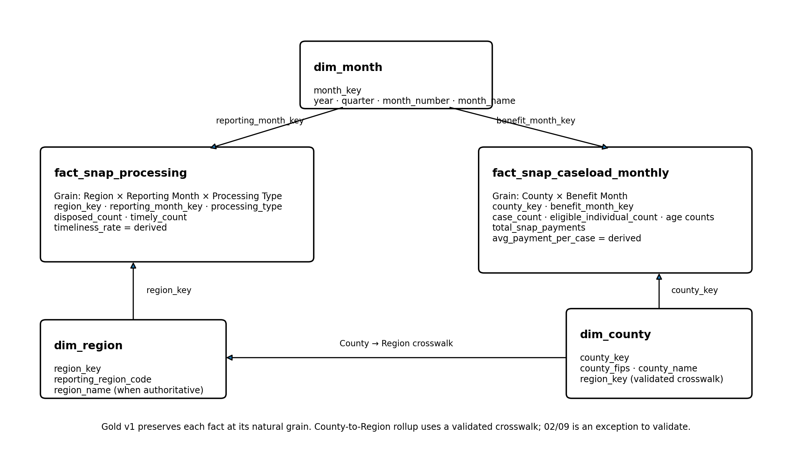

# SNAP Analytics Platform V2 --- Dashboard Design

**Module:** Module 3 --- Analytics Modeling / Gold Layer\
**Status:** v0.4 --- Design Complete / Gold Logical Schema v1 Frozen\
**Primary Audience:** Program Leadership

## 1. Purpose

The SNAP dashboard is designed as a **decision-support tool**, rather
than a reporting-only interface.

Its primary goal is to help program leadership identify geographic areas
that may warrant greater attention when planning future program
resources.

The design follows a decision-first principle:

> Start with the decision the user needs to make, then work backward to
> the business questions, metrics, trusted source data, model grain, and
> dashboard experience required to support that decision.

## 2. Primary User and Dashboard Type

### Primary User --- Program Leadership

Program leadership is responsible for strategic program planning and
resource allocation. The first SNAP dashboard is therefore designed
primarily as a **Strategic Dashboard**, rather than an operational or
root-cause-analysis dashboard.

### Primary Decision

> **Which geographic areas warrant leadership attention when planning
> future SNAP program resources?**

### Design Principle

> **Leadership needs the signal; analysts need the investigation.**

Leadership should be able to identify where attention may be required.
Analysts can then investigate why an issue exists, whether it is
persistent, and what factors may be driving it.

## 3. Core Business Questions --- Gold v1

Gold v1 is intentionally decision-driven. During modeling, the original
three-question structure was challenged against the actual source data
and the leadership decision.

The primary decision remains:

> **Which geographic areas warrant leadership attention when planning
> future SNAP program resources?**

Gold v1 therefore uses two primary Business Questions.

### BQ1 --- Workload

> **Where is SNAP workload high?**

Gold v1 uses two complementary workload signals:

-   **Caseload / Program Load:** Month-end SNAP cases represent ongoing
    program load.
-   **Processing Workload:** Disposed cases represent processing
    activity completed during a reporting period.

These measures must not be added together. Caseload is a periodic
snapshot; disposed volume is a processing flow.

### BQ2 --- Processing Performance

> **How well is that workload being processed?**

Processing performance is evaluated separately by processing type:

-   **Application Timeliness:** compare the actual rate with the
    validated USDA FNS acceptable-performance benchmark of **95% or
    above**.
-   **Redetermination / Recertification Timeliness:** show the actual
    rate, trend, and regional comparison. Do **not** apply the 95%
    Application Processing Timeliness benchmark unless an authoritative
    redetermination benchmark is validated.

The USDA-reported **87.50% Texas FY2024 Recertification Processing
Timeliness** is a historical actual performance value, **not a target or
benchmark**.

Application and Redetermination should not be combined into one primary
Timeliness KPI because different processing volumes and performance can
mask problems in one processing type.

### Analytical Context --- Not a Primary Leadership BQ

The caseload fact may still retain:

-   Eligible individual count
-   Eligible individuals by age group
-   Total SNAP payments
-   Derived average payment per case

These are source-supported analytical measures, but Gold v1 does not
force them into the primary leadership dashboard without a demonstrated
decision use.

> **Gold model availability does not imply dashboard KPI relevance.**

Population and poverty remain potential future enrichments and are not
current project datasets.

## 4. Metric Design --- Gold v1

### 4.1 Program Load --- Month-End SNAP Case Count

**Metric:** SNAP Case Count\
**Source meaning:** Number of SNAP cases reported at month end for a
county and benefit month.\
**Business use:** Indicates ongoing program / caseload load.\
**Candidate grain:** County × Benefit Month.\
**Aggregation behavior:** **Semi-additive.**

Across counties within the same benefit month, case counts may be summed
to a larger geography when the geography crosswalk is valid.

Across months, monthly case counts must **not** be summed and
interpreted as unique annual cases because the same case may appear in
multiple monthly snapshots.

### 4.2 Eligible Individuals

**Metric:** Eligible Individual Count\
**Business use:** Describes the number of eligible people represented in
the month-end SNAP caseload.\
**Candidate grain:** County × Benefit Month.\
**Aggregation behavior:** **Semi-additive** for the same reason as case
count.

Age-band counts are stored as base measures:

-   Under age 5
-   Age 5--17
-   Age 18--59
-   Age 60--64
-   Age 65+

**Validation rule:**

`Sum of age-band eligible counts = eligible_individual_count`

A mismatch should trigger investigation rather than automatic
correction.

### 4.3 Total SNAP Payments

**Metric:** Total SNAP Payments\
**Business use:** Measures benefit dollars paid for the reporting
geography / benefit month.\
**Candidate grain:** County × Benefit Month.\
**Aggregation behavior:** **Additive** across geography and time when
the source definition represents monthly payments.

Unlike caseload snapshots, payments made in separate months represent
separate dollar flows and can be accumulated for period spending.

### 4.4 Average Payment per Case

**Metric:** Average Payment per Case\
**Type:** Derived metric.

`Average Payment per Case = SUM(total_snap_payments) / SUM(case_count)`

The source-reported average may be retained for reconciliation, but Gold
should derive the analytical metric from its base components rather than
averaging pre-calculated averages.

### 4.5 Processing Volume

**Metric:** Disposed Count\
**Business use:** Measures processing workload completed during a
reporting period.\
**Candidate grain:** Region × Reporting Month × Processing Type.\
**Base measure:** Stored.

`processing_type` currently distinguishes Application and
Redetermination. Gold v1 keeps this low-cardinality category in the fact
rather than creating a separate dimension with no meaningful descriptive
attributes.

Disposed counts are additive across regions and reporting periods when
the resulting aggregation answers a valid business question. Aggregation
across processing types is mathematically possible, but the combined
result must be labeled as total processing workload rather than
application volume.

### 4.6 Timely Count and Timeliness Rate

**Base measure:** `timely_count`\
**Derived metric:** `timeliness_rate`

`Timeliness Rate = SUM(timely_count) / SUM(disposed_count)`

Timeliness Rate is **non-additive**. It should not be summed or naively
averaged across regions or periods because the underlying disposed
volumes may differ.

Example:

-   Month A: 90 timely / 100 disposed = 90%
-   Month B: 800 timely / 1,000 disposed = 80%

Naive average = 85%, but the correct combined rate is:

`(90 + 800) / (100 + 1,000) = 80.9%`

**Production rule:** Store additive base components and derive ratios
from numerator and denominator whenever possible.

**Benchmark governance:**

-   Application Timeliness: **95% or above** is the validated USDA FNS
    acceptable-performance benchmark.
-   Redetermination / Recertification Timeliness: no validated 95%
    benchmark is assigned in Gold v1.
-   Texas FY2024 Recertification Timeliness of **87.50%** is reference
    actual performance only.
-   A combined Application + Redetermination Timeliness rate is not a
    primary KPI.

## 5. Gold Logical Model v1

Gold v1 uses a **multi-fact dimensional model** because the two source
domains represent different business processes and natural grains.

**Design status:** **Gold Logical Schema v1 Frozen 🔒**

The frozen logical model contains **2 fact tables + 3 dimensions**. No
additional fact or dimension is required for Gold v1 unless
implementation validation reveals a material source/grain issue.

### 5.1 Fact #1 --- `fact_snap_processing`

**Business process:** SNAP Processing Performance\
**Candidate grain:** One row per **Region × Reporting Month × Processing
Type**

Core fields:

-   `region_key`
-   `reporting_month_key`
-   `processing_type`
-   `disposed_count`
-   `timely_count`

Derived:

-   `timeliness_rate`

### 5.2 Fact #2 --- `fact_snap_caseload_monthly`

**Business process:** Monthly SNAP Benefit Caseload & Eligibility
Snapshot\
**Candidate grain:** One row per **County × Benefit Month**

Core fields:

-   `county_key`
-   `benefit_month_key`
-   `case_count`
-   `eligible_individual_count`
-   age-band eligible counts
-   `total_snap_payments`

Derived:

-   `avg_payment_per_case`

### 5.3 `dim_month` --- Shared / Conformed Monthly Dimension

Both facts use the same calendar-month dimension, while preserving
different business roles:

-   `fact_snap_processing.reporting_month_key → dim_month.month_key`
-   `fact_snap_caseload_monthly.benefit_month_key → dim_month.month_key`

Candidate attributes:

-   `month_key`
-   `year`
-   `quarter`
-   `month_number`
-   `month_name`

The shared dimension is valid only if Reporting Month and Benefit Month
both map to the same calendar-month structure. Their business meanings
remain distinct even when both reference, for example, April 2024.

### 5.4 `dim_region`

Candidate attributes:

-   `region_key`
-   `reporting_region_code`
-   `region_name` when supported by authoritative reference data

### 5.5 `dim_county`

Candidate attributes:

-   `county_key`
-   `county_fips`
-   `county_name`
-   `region_key` through a validated County → reporting-region crosswalk

### 5.6 County → Region Geography Crosswalk

The project should not discard a broadly valid geography relationship
because a small number of exceptions require investigation.

Implementation pattern:

`County Source → Join Authoritative County/Region Reference → Validate Matches → Investigate Unmatched Counties → Publish Crosswalk`

The source-defined `02/09` reporting region is treated as a **known
exception / validation item**. Authoritative mappings should be used
wherever available; remaining exceptions should be isolated and
documented rather than silently inferred.

A useful validation report should include:

-   Expected Texas counties
-   Successfully mapped counties
-   Unmatched counties
-   Duplicate / ambiguous mappings
-   Explicit exception handling

## 6. Measure Additivity Rules

  ----------------------------------------------------------------------------
  Measure                       Across         Across Time    Classification
                                Geography                     
  ----------------------------- -------------- -------------- ----------------
  `disposed_count`              Yes            Yes            Additive

  `timely_count`                Yes            Yes            Additive

  `timeliness_rate`             No direct      No direct      Non-additive /
                                SUM/AVG        SUM/AVG        Derived

  `case_count`                  Yes at same    Not as unique  Semi-additive
                                snapshot       caseload       
                                period                        

  `eligible_individual_count`   Yes at same    Not as unique  Semi-additive
                                snapshot       individuals    
                                period                        

  Age-band eligible counts      Yes at same    Not as unique  Semi-additive
                                snapshot       individuals    
                                period                        

  `total_snap_payments`         Yes            Yes            Additive

  `avg_payment_per_case`        No direct SUM  No naive AVG   Non-additive /
                                                              Derived
  ----------------------------------------------------------------------------

### Production Interpretation Rule

> **Technical aggregation does not automatically equal meaningful
> business aggregation.**

Before aggregating a measure, confirm that the resulting number still
answers a valid business question.

## 7. Grain and Join Safety

### Grain Principle

> **Grain defines what one row represents. Measures define what is
> quantified at that grain.**

Gold v1 preserves each business process at its natural grain rather than
forcing all source data into one table.

### Fact-to-Dimension Joins

Safe examples:

`fact_snap_processing.reporting_month_key = dim_month.month_key`

`fact_snap_caseload_monthly.benefit_month_key = dim_month.month_key`

### Fact-to-Fact Join Warning

The two facts must not be directly joined only because their month keys
match.

Processing fact:

`Region × Month × Processing Type`

Caseload fact:

`County × Month`

A month-only fact-to-fact join would create row duplication /
many-to-many behavior. County-level caseload must first be rolled up
through a validated County → Region crosswalk when a Region-level
comparison is required.

## 8. KPI Governance Principles Applied to SNAP

Research Question #2 established the following governance model:

`Business Objective → Business Meaning → Metric Definition → Business Alignment → Owner/Steward → Central Implementation → Testing → Dashboard → Change Management`

### Business Governance vs. Technical Governance

> **Business Governance defines what the metric means. Technical
> Governance ensures that meaning is implemented consistently
> everywhere.**

For each governed metric, explicitly consider:

-   Business purpose
-   Business definition
-   Formula
-   Grain
-   Time window
-   Filters
-   Inclusions / exclusions
-   Source / system of record
-   Business owner or steward
-   Technical implementation
-   Validation / testing
-   Change management

### Consistency Does Not Mean Forced Standardization

Different teams may legitimately need different metrics when they answer
different business questions. Governance means that business meaning is
explicit and that a given definition is calculated consistently wherever
it is used.

### Official vs. Analyst-Derived Metrics

Official / source-defined metrics should follow authoritative
definitions and benchmarks when available.

Analyst-derived metrics must document their business purpose, formula,
assumptions, source, limitations, and validation status. They should not
be presented as official policy metrics without supporting evidence.

## 9. Metric Conflict Resolution --- Production Pattern

Example:

> Finance reports Active Customers = 12,400, while Product reports
> Active Customers = 15,800.

Do not assume one team is wrong or begin by debugging SQL. First
compare:

1.  Business purpose
2.  Business definition
3.  Grain
4.  Formula
5.  Time window
6.  Filters
7.  Inclusion / exclusion rules
8.  Source data

Then determine whether the organization needs one shared definition or
two legitimately different metrics with clearer names and ownership.
Once aligned, implement shared logic centrally, validate it, update
downstream assets, and govern future definition changes.

## 10. Dashboard Decision Flow --- Gold v1

The final primary decision flow is:

`Workload → Processing Performance → Leadership Attention → Analyst Investigation`

### Workload

Use both:

-   Ongoing program load (`case_count`)
-   Operational processing workload (`disposed_count`)

These measures are complementary but must not be combined into one
total.

### Processing Performance

Use:

-   `disposed_count`
-   `timely_count`
-   Derived `timeliness_rate`
-   `processing_type`

Application Timeliness is evaluated against the validated **95% USDA FNS
benchmark**.

Redetermination / Recertification Timeliness is presented as actual
performance and trend without assigning the Application benchmark.

### Analytical Context

Eligible individuals, age profile, total payments, and average payment
per case remain available for analytical exploration. They are not
primary leadership KPIs in Gold v1 because a direct resource-planning
decision use has not yet been established.

### No Unsupported Composite Priority Score

Gold v1 will not create an arbitrary composite priority score because no
authoritative business evidence currently supports weighting workload,
context, and performance into a resource-allocation formula.

## 11. Information Hierarchy

Current direction:

`Leadership Signal → Supporting Context → Geographic Area → Analytical Investigation`

The exact visual hierarchy will be finalized after Gold implementation
validates the model and available analytical combinations.

## 12. Analytical Investigation Boundary

Detailed questions belong primarily to the analytical layer:

-   Why did performance change?
-   When did the issue begin?
-   Is the issue temporary or persistent?
-   Which operational factor is driving the change?

Leadership may receive concise trend signals, but the Strategic
Dashboard should not become a full root-cause-analysis workspace.

## 13. Current Data State and Implementation Dependencies

### 13.1 Eligible / Caseload Domain

Current state:

`Raw/Bronze → Transformation & Validation Logic Implemented → Validation Gate → Trusted Silver Not Yet Published`

No trusted Silver dataset currently exists. Silver publication remains
blocked by incomplete reference-data validation.

Therefore the Gold grain described in this document remains a
**candidate logical grain** until the successfully published Silver data
is profiled and validated.

### 13.2 Timeliness Domain

Current state:

`Raw/Source Available → Transformation Not Yet Built → Validation Not Yet Built → Silver Not Available`

Before `fact_snap_processing` can be physically implemented, the
Timeliness source requires its own transformation, standardization,
business validation, and Silver publication path.

### 13.3 Geography Reference

County → Region mapping is an implementation dependency. The majority of
authoritative mappings should be applied first; unmatched / ambiguous
counties and the `02/09` reporting exception should then be investigated
explicitly.

## 14. Future External Data Enhancements

Population and Poverty Rate were considered during early dashboard
design but are **not current project datasets**.

Potential future enrichment includes:

-   County population
-   Poverty Rate
-   Program-specific SNAP-eligible population / household estimates

These should enter the model only after:

1.  A source is selected.
2.  Business meaning is validated.
3.  Temporal and geographic grain is understood.
4.  Refresh cadence is understood.
5.  Join compatibility with existing facts is validated.

Gold v1 should not model or advertise these metrics as currently
available.

## 15. Validation Rules Identified During Modeling

### Caseload / Eligibility

**Age reconciliation**

`under_5 + age_5_17 + age_18_59 + age_60_64 + age_65_plus = eligible_individual_count`

### Timeliness

**Rate reconciliation**

`calculated_timeliness_rate ≈ source_percent`

The source percentage can be retained for validation / reconciliation,
while the Gold analytical rate is derived from timely and disposed
counts.

### Geography

Validate:

-   County reference coverage
-   Unmatched counties
-   Duplicate mappings
-   Ambiguous mappings
-   `02/09` exception handling

## 16. Design Decisions and Trade-offs

### Decision 1 --- Preserve Natural Grain

**Selected:** Separate Processing Performance and Caseload Snapshot
facts.\
**Reason:** They represent different business processes and different
geographic grains.

### Decision 2 --- Use a Multi-Fact Model

**Selected:** Two facts sharing standardized dimensions where business
meaning supports it.\
**Reason:** This avoids forcing unrelated processes into one fact and
reduces incorrect aggregation risk.

### Decision 3 --- Shared Monthly Dimension

**Selected:** One `dim_month`, used as Reporting Month in the processing
fact and Benefit Month in the caseload fact.\
**Reason:** Both use monthly calendar analysis while retaining distinct
business roles.

### Decision 4 --- Geography Relationship

**Selected:** Connect County to Region through a validated crosswalk.\
**Reason:** Most geography relationships can be authoritative; isolated
exceptions should be validated rather than causing the entire
relationship to be discarded.

### Decision 5 --- `processing_type` Remains in Fact for v1

**Selected:** No separate `dim_processing_type` yet.\
**Reason:** The current category has very low cardinality and no
meaningful descriptive hierarchy or attributes requiring a dedicated
dimension.

### Decision 6 --- Derive Ratios and Averages

**Selected:** Derive Timeliness Rate and Average Payment per Case from
base components.\
**Reason:** Base measures support correct weighted aggregation and
reconciliation.

### Decision 7 --- Do Not Sum Snapshot Counts Across Time as Unique Population

**Selected:** Treat case and eligible-individual counts as
semi-additive.\
**Reason:** The same case / individual may appear in multiple month-end
snapshots.

### Decision 8 --- External Population / Poverty Deferred

**Selected:** Future enhancement, not Gold v1.\
**Reason:** These datasets have not yet been sourced or modeled.

### Decision 9 --- Avoid Unsupported Decision Scores

**Selected:** Expose workload, caseload context, and performance
separately.\
**Reason:** The project lacks authoritative business rules for weighting
these signals into a composite resource-allocation score.

## 17. Research Status

### Research Question #1 --- Dashboard Design Process

**Status: Closed v1 ✅**

Key production pattern:

`Business Problem / Decision → Stakeholders & Users → Business Questions → Trusted Metrics → Prototype / Design → Summary / Context / Drill-down → Review / UAT → Release → Adoption / Feedback → Iterate`

### Research Question #2 --- KPI Governance

**Status: Closed v1 ✅**

Key production pattern:

`Business Objective → Business Meaning → Metric Definition → Alignment → Ownership → Central Implementation → Testing → Consumption → Change Management`

### Remaining Research Questions

-   #3 Analytics Development Lifecycle
-   #4 Analytics Review / Approval
-   #5 Analytics Design Trade-offs

## 18. Module 3 Design Closeout

### Design Status

**Module 3 Gold Analytics Modeling Design: Complete ✅**\
**Gold Logical Schema v1: Frozen 🔒**\
**Physical Gold Implementation: Pending Silver Dependencies**

### Completed in Logical Modeling v1

-   Leadership decision and primary user defined
-   Primary Business Questions finalized
-   Two business processes identified
-   Candidate grains defined
-   Base vs. derived measures identified
-   Additivity behavior classified
-   Core dimensions identified
-   Shared monthly dimension designed
-   County → Region crosswalk approach defined
-   Join-safety rules documented
-   Business validation rules identified
-   Application benchmark scope clarified
-   Application and Redetermination performance separated
-   Non-decision-relevant source measures separated from primary
    dashboard KPIs
-   Five-table Gold Logical Schema v1 frozen

### Physical Implementation Requirements

1.  **Publish and profile trusted Eligible / Caseload Silver**
    -   Complete remaining reference-data validation.
    -   Publish trusted Silver output.
    -   Confirm actual grain is consistent with
        `County × Benefit Month`.
2.  **Build Timeliness transformation / validation / Silver**
    -   Structure cleaning
    -   Normalization
    -   Type conversion
    -   Business validation
    -   Validation report
    -   Validation gate
    -   Silver publication
    -   Confirm actual grain is consistent with
        `Region × Reporting Month × Processing Type`.
3.  **Build and validate County → Region crosswalk**
    -   Validate county coverage.
    -   Identify unmatched, duplicate, or ambiguous mappings.
    -   Handle the `02/09` reporting exception explicitly.
4.  **Validate actual Silver grains**
    -   Test uniqueness at the candidate fact grains.
    -   Investigate duplicates rather than hiding them with aggregation.
5.  **Build the five Gold tables**
    -   `fact_snap_processing`
    -   `fact_snap_caseload_monthly`
    -   `dim_month`
    -   `dim_region`
    -   `dim_county`
6.  **Run Gold validation**
    -   Grain uniqueness
    -   Referential integrity
    -   Null / orphan keys
    -   Measure reconciliation
    -   Age-band reconciliation
    -   Timeliness reconciliation
    -   Geography crosswalk coverage

### Execution Path

`Module 3 Design Complete → Return to Module 2 Timeliness Cleaning → Publish Trusted Silver → Return to Module 3 Physical Gold Build → Gold Validation`

The next active development task is therefore **Timeliness cleaning and
Silver preparation**, not additional Gold schema design.
